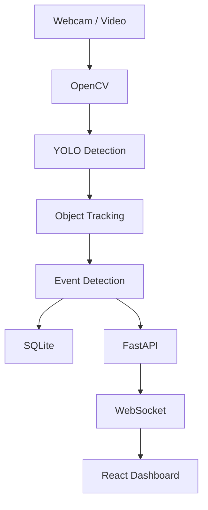
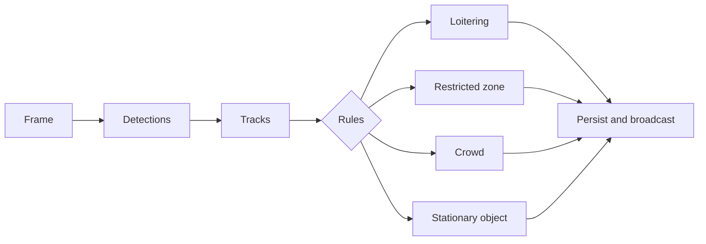

# AI Vision Security

Real-time AI-powered, local-first computer-vision security monitoring using YOLO, object tracking, FastAPI, SQLite, and React.

> Educational/portfolio software, not a production security system. Event priorities are application-defined and do not measure real-world risk.

      

## Features

- Webcam and local video-file sources, processed in a background thread.
- Genuine Ultralytics YOLO detection; model weights are downloaded/cached by Ultralytics on first run and are not committed.
- Persistent class-aware centroid tracking. It is lightweight and YOLO-compatible; substitute Ultralytics ByteTrack for crowded-scene accuracy.
- Rule-based loitering, restricted-zone entry, crowd, and stationary-object/abandoned-object heuristic events.
- FastAPI REST API, WebSocket updates at `/ws/live`, MJPEG stream at `/api/cameras/stream`, SQLite/SQLAlchemy persistence, and React dashboard.

## Architecture





## Install and run

Requirements: Python 3.11+, Node.js 20+, and a local webcam or video file. From the repository root:

```bash
python -m venv .venv
# Windows: .venv\\Scripts\\activate    Linux/macOS: source .venv/bin/activate
pip install -r requirements.txt
copy .env.example .env  # Windows; use cp .env.example .env elsewhere
uvicorn backend.main:app --reload --host 0.0.0.0 --port 8000
```

In a second terminal:

```bash
cd frontend
npm install
npm run dev
```

Open `http://localhost:5173`. Start camera source `0` in **Cameras** for the default webcam. For a file, enter its absolute path (for example `C:\\video\\clip.mp4`), or set `CAMERA_SOURCE` before starting. The first YOLO run may download `yolo11n.pt`; it needs internet access once or a pre-cached model path via `YOLO_MODEL`.

## API and live data

`GET /api/health`, `/api/events`, `/api/events/{id}`, `/api/detections`, `/api/statistics`, `/api/cameras`, `/api/settings`; `POST /api/cameras/start`, `/api/cameras/stop`; `PUT /api/settings`; and `DELETE /api/events/{id}`. Interactive docs: `http://localhost:8000/docs`. `/ws/live` emits actual processor state every second.

## Configuration and rules

Copy `.env.example`. `RESTRICTED_ZONE_POINTS` is JSON pixel coordinates such as `[[10,10],[400,10],[400,300],[10,300]]`. Rules only fire while tracks are observed. Loitering uses track duration; crowd uses active people count; stationary-object detection is a deliberately conservative heuristic and can be wrong. Update dashboard settings, then restart processing for active rule engines to reload them.

## Testing and build

```bash
pytest
cd frontend && npm run build
```

## Docker

```bash
docker compose up --build
```

Docker camera forwarding is OS/runtime dependent; local development is the reliable webcam route. A video file must be mounted into the backend container and referenced by its container path.

## Privacy and limitations

No facial recognition, identity inference, face storage, cloud upload, or raw-video recording is implemented. Processing is local by default. Detection/tracking accuracy depends on model, lighting, occlusion, camera placement, and hardware. This project is unsuitable as the sole basis for safety or enforcement decisions.

## Screenshots

See [screenshots/README.md](screenshots/README.md). They must be captured from a real local run; none are fabricated.

## Project layout

`backend/` API/database/services; `detection/` YOLO adapter; `tracking/` tracking state; `event_detection/` rules; `frontend/` dashboard; `tests/` automated checks.

## Contributing and license

Issues and focused pull requests are welcome. Released under the [MIT License](LICENSE).

## GitHub Topics

computer-vision, artificial-intelligence, machine-learning, yolo, opencv, fastapi, react, object-detection, object-tracking, security-monitoring, python, real-time, ai-project, computer-vision-project
